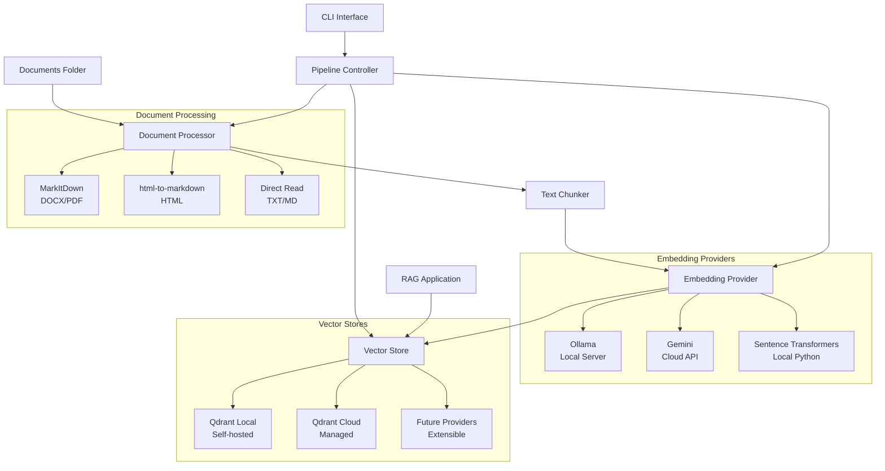

## 🎯 Perfect for RAG Applications

This pipeline serves as the **foundation for RAG systems**, handling the critical ingestion and vectorization phase that enables semantic search and context retrieval for AI applications.

**What it does:**

1. **Ingests** documents from multiple formats (.txt, .docx, .pdf, .md, .html, .json)
2. **Processes** them into semantically meaningful chunks
3. **Generates embeddings** using your choice of providers
4. **Stores** in vector databases for fast similarity search
5. **Provides** APIs for RAG applications to query and retrieve context

## ✨ Key Features

### 🔄 **Multiple Embedding Providers**

- **Ollama** (Local server) - Self-hosted, privacy-focused
- **Google Gemini** (Cloud API) - High-quality, scalable
- **Sentence Transformers** (Local Python) - Lightweight, browser-compatible

### 🔍 **Advanced Search Capabilities**

- **Semantic Search** - Dense vector similarity for contextual understanding
- **Exact Phrase Search** - Sparse vector indexing for precise keyword matching
- **Hybrid Search** - Native Qdrant RRF fusion combining both approaches
- **Multiple Search Strategies** - Auto, semantic, exact, hybrid_rrf, hybrid_weighted
- **Flexible Output Formats** - Detailed, RAG-optimized, or JSON output

### 📁 **Comprehensive Document Support**

- Text files (.txt, .md)
- Microsoft Word (.docx)
- PDF documents (.pdf)
- HTML pages (.html)
- JSON structured content (.json)
- **Article fetcher** - Direct URL processing with AI analysis
- Automatic markdown conversion for consistent processing

### 🗄️ **Flexible Vector Storage**

- **Qdrant Local** - Self-hosted for privacy
- **Qdrant Cloud** - Managed service for scalability
- Unified client interface for seamless switching

### 🛠️ **Developer Experience**

- Single configuration file with comprehensive examples
- Full CLI interface for all operations
- Comprehensive unit test coverage
- Type hints and detailed documentation

## 🏗️ Architecture



## 🚀 Quick Start

### Option 1: Build Knowledge Base from Online Articles (Fastest)

Perfect for quickly building a knowledge base from online content:

```bash
# Clone and setup
git clone https://github.com/able-wong/doc-embeddings-pipeline.git
cd doc-embeddings-pipeline
python3 -m venv venv && source venv/bin/activate
pip install -r requirements.txt

# Quick configuration - use Sentence Transformers (no external dependencies)
cp config.yaml.example config.yaml
# Edit config.yaml: set embedding.provider: "sentence_transformers"

# Start local Qdrant (one-time setup)
docker run -d --name qdrant -p 6333:6333 -v $(pwd)/qdrant_data:/qdrant/storage qdrant/qdrant

# Build your knowledge base from articles (creates viewable HTML files)
python fetch_article.py --non-interactive --output-format=html \
  https://example.com/article1 \
  https://example.com/article2 \
  https://example.com/article3

# View the processed articles in your browser (e.g., by opening the files in data/articles/html/)

# Also create JSON format for vector database ingestion
python fetch_article.py --non-interactive --output-format=json \
  https://example.com/article1 \
  https://example.com/article2 \
  https://example.com/article3

# Ingest into vector database
python3 ingest.py reindex-all

# Search your knowledge base
python3 ingest.py search "your query here"
```

### Option 2: Process Local Documents

For existing document collections:

```bash
# Same setup as above, then:

# Add your documents to ./documents folder
# Supported: .txt, .docx, .pdf, .md, .html, .json

# Process all documents
python3 ingest.py reindex-all

# Search your documents
python3 ingest.py search "your query here"
```

### Option 3: Hybrid Approach

Combine online articles with local documents:

```bash
# Fetch articles with AI analysis (creates both HTML and JSON)
python fetch_article.py --non-interactive --output-format=html \
  https://site1.com/article1 https://site2.com/article2

python fetch_article.py --non-interactive --output-format=json \
  https://site1.com/article1 https://site2.com/article2

# View the AI analysis in your browser
open data/articles/html/*.html

# Add local documents to ./documents folder

# Process everything together
python3 ingest.py reindex-all

# Your knowledge base now contains both online articles with AI analysis
# and local documents - all searchable together!
```

## 🐛 Troubleshooting

### Common Issues

**Dimension Mismatch:**

```bash
# Clear collection when switching providers
python3 ingest.py clear-all
python3 ingest.py reindex-all
```

### Prerequisites

- **Python 3.10+**
- **Docker** (for local Qdrant) - [Install Docker Desktop](https://www.docker.com/products/docker-desktop/)
- **Choose your embedding provider:**
  - Ollama (local) - Install with `brew install ollama`
  - Gemini (cloud) - Get API key from [Google AI Studio](https://ai.google.dev/)
  - Sentence Transformers (local) - No external dependencies
- **Choose your vector database:**
  - Qdrant Local - Uses Docker (`docker pull qdrant/qdrant`)
  - Qdrant Cloud - Sign up at [cloud.qdrant.io](https://cloud.qdrant.io/)

### Installation

```bash
# Clone the repository
git clone https://github.com/able-wong/doc-embeddings-pipeline.git
cd doc-embeddings-pipeline

# Create virtual environment
python3 -m venv venv
source venv/bin/activate  # On Windows: venv\Scripts\activate

# Install dependencies
pip install -r requirements.txt

# Configure the pipeline
cp config.yaml.example config.yaml
# Edit config.yaml with your settings
```

### First Run

```bash
# Start your chosen services (if using local providers)
ollama serve                    # If using Ollama

# If using local Qdrant with Docker:
docker run -d --name qdrant \
    -p 6333:6333 -p 6334:6334 \
    -v $(pwd)/qdrant_data:/qdrant/storage \
    qdrant/qdrant

# Test connections
python3 ingest.py test-connections

# Add documents to the ./documents folder, then
python3 ingest.py reindex-all

# Search your documents
python3 ingest.py search "your search query"

# 🎯 Verify your collection visually
# Open the Qdrant Web UI to see your vectors and collection details
# Access at: http://localhost:6333/dashboard
# See QDRANT_WEB_UI_GUIDE.md for detailed instructions
```

> **💡 Pro Tip**: After running `reindex-all`, open the [Qdrant Web UI](http://localhost:6333/dashboard) to visually verify your collection. See the **[Qdrant Web UI Guide](QDRANT_WEB_UI_GUIDE.md)** for details on inspecting vectors, viewing payloads, and troubleshooting.

## 🌐 Article Fetcher

The pipeline includes a powerful article fetcher that can process online articles directly from URLs with AI-powered analysis and multiple output formats.

### Features

- **Clean content extraction** - Uses newspaper3k to extract article content while filtering out ads, navigation, and unrelated elements
- **Granular content control** - Choose between clean article only, summary/insights only, analysis sections only, or comprehensive output
- **AI-powered analysis** - Comprehensive LLM analysis including 600-word summaries, key insights, source reliability assessment, fact-checking, and citation extraction
- **Multiple output formats** - JSON for data processing or HTML for publishing
- **Interactive & automated modes** - Step-by-step approval workflow or fully automated processing
- **Paywall handling** - Manual content input when automatic extraction fails
- **Duplicate detection** - Checks against existing content to avoid processing duplicates
- **Copyright-safe options** - Summary and analysis modes exclude original content for copyright compliance

### Quick Usage

```bash
# Clean article content only (default behavior)
python fetch_article.py https://example.com/article

# Summary and key insights only (no original article)
python fetch_article.py --summary https://example.com/article

# Clean article + comprehensive analysis (reliability, fact-checking, citations)
python fetch_article.py --analysis https://example.com/article

# Summary + analysis sections only (no original article)
python fetch_article.py --summary --analysis https://example.com/article

# Non-interactive automation with content selection
python fetch_article.py --non-interactive --summary --output-format=json https://site1.com/article1

# HTML export for publishing with analysis
python fetch_article.py --non-interactive --analysis --output-format=html --output-dir=./knowledge-base https://example.com/article

# Console output for piping 
python fetch_article.py --non-interactive --summary --analysis --output-console https://example.com/article
```

### Content Selection Logic

The article fetcher provides granular control over what content is included in the output:

| Flags | Output Content | Use Case |
|-------|---------------|----------|
| None | Clean article content only | Original article with ads/navigation removed |
| `--summary` | Summary + Key insights only | Article highlights without original content |
| `--analysis` | Clean article + Analysis sections | Full article with credibility assessment |
| `--summary --analysis` | Summary + Insights + Analysis only | Complete AI analysis without original content |

**Analysis sections include:**

- Source reliability assessment
- Fact-checking analysis  
- Citations and references

### Interactive Workflow

1. **Content extraction** - Automatically fetches clean article content
2. **AI analysis** - Generates comprehensive analysis (summary, insights, reliability, fact-checking, citations)  
3. **Step-by-step approval**:
   - Review and approve summary (or regenerate)
   - Review and correct author information
   - Review and correct publication date
   - Review and modify tags
   - Add optional notes
4. **File generation** - Creates structured JSON or HTML files

### Output Formats

**JSON Format** (for vector database ingestion):

- Structured metadata with AI analysis in markdown format
- Compatible with existing pipeline for semantic search
- Includes original content for full-text indexing

**HTML Format** (for publishing and copyright compliance):

- Clean, styled HTML with semantic structure
- Custom meta tags for metadata preservation
- Only AI analysis content (no original article text)
- Optimized for semantic search indexing

### Automation Support

- **Exit codes** - 0 (success), 1 (partial failure), 2 (complete failure)
- **Non-interactive mode** - Skip all prompts for CI/CD integration
- **Batch processing** - Handle multiple URLs efficiently
- **newspaper3k priority** - Reliable metadata extraction from HTML structure
- **Fail-fast approach** - Skip problematic URLs instead of degraded results

### Integration with Pipeline

Articles processed by the fetcher integrate seamlessly with the main pipeline:

```bash
# Process articles and add to vector database
python fetch_article.py --non-interactive --output-format=json https://example.com/article
python3 ingest.py add-update data/articles/json/2025-01-15-article-title.json
```

## 📖 Usage Examples

### Basic Operations

```bash
# Test all connections
python3 ingest.py test-connections

# Process all documents in ./documents folder
python3 ingest.py reindex-all

# Add or update a specific document
python3 ingest.py add-update path/to/document.pdf

# Search documents with different strategies
python3 ingest.py search "machine learning algorithms" --limit 5
python3 ingest.py search "neural networks" --strategy semantic --limit 3
python3 ingest.py search "API endpoints" --strategy exact --threshold 0.0
python3 ingest.py search "deep learning tutorials" --strategy hybrid_rrf --show-scores

# Different output formats
python3 ingest.py search "data science" --format rag --limit 5
python3 ingest.py search "AI algorithms" --format json --strategy auto

# View collection statistics
python3 ingest.py stats

# List all indexed documents
python3 ingest.py list-documents
```

### Provider Switching

```bash
# Use Sentence Transformers (fastest setup)
# Edit config.yaml: set provider: "sentence_transformers"
python3 ingest.py test-connections

# Use Ollama with specific model
# Edit config.yaml: set provider: "ollama", model: "nomic-embed-text"
python3 ingest.py test-connections

# Use Gemini (requires API key)
export GEMINI_API_KEY="your-api-key"
# Edit config.yaml: set provider: "gemini"
python3 ingest.py test-connections
```

## 🔧 Configuration

The pipeline uses a single configuration file with comprehensive examples:

### Key Configuration Sections

```yaml
# Embedding provider selection
embedding:
  provider: "sentence_transformers"  # or "ollama" or "gemini"
  
  sentence_transformers:
    model: "all-MiniLM-L6-v2"        # 384D, ~90MB, browser-compatible
    device: "cpu"                    # or "cuda", "mps"

# Sparse embedding for exact phrase matching (optional)
sparse_embedding:
  provider: "splade"                 # Neural sparse retrieval
  splade:
    model: "naver/splade-cocondenser-ensembledistil"
    device: "cpu"                    # or "cuda", "mps"

# Vector database selection  
vector_db:
  provider: "qdrant"
  host: "localhost"                  # For local Qdrant
  # url: "https://..."               # For Qdrant Cloud
  collection_name: "documents"
```

### Environment Variables

The pipeline supports complete configuration via environment variables, perfect for serverless deployments and containerized environments.

#### API Keys (Recommended)

```bash
export GEMINI_API_KEY="your-gemini-key"
export QDRANT_API_KEY="your-qdrant-key"
```

#### Complete Environment Variable Configuration

Set `CONFIG_FROM_ENV=true` to use environment variables instead of config files:

```bash
# Core configuration
export CONFIG_FROM_ENV=true
export EMBEDDING_PROVIDER="gemini"                    # or "ollama", "sentence_transformers"
export EMBEDDING_MODEL="text-embedding-004"           # Provider-specific model
export VECTOR_DB_PROVIDER="qdrant"
export COLLECTION_NAME="documents"

# Embedding provider settings
export GEMINI_API_KEY="your-api-key"                  # For Gemini
export GEMINI_MODEL="text-embedding-004"
export OLLAMA_BASE_URL="http://localhost:11434"       # For Ollama
export SENTENCE_TRANSFORMERS_MODEL="all-MiniLM-L6-v2" # For Sentence Transformers
export SENTENCE_TRANSFORMERS_DEVICE="cpu"             # "cpu", "cuda", "mps"

# Vector database settings
export QDRANT_URL="https://your-cluster.qdrant.io:6333"  # For Qdrant Cloud
export QDRANT_API_KEY="your-qdrant-key"                  # For Qdrant Cloud
export QDRANT_HOST="localhost"                           # For local Qdrant
export QDRANT_PORT="6333"                                # For local Qdrant

# Document processing
export DOCUMENTS_FOLDER="./documents"
export CHUNK_SIZE="1000"
export CHUNK_OVERLAP="200"

# Logging
export LOG_LEVEL="INFO"                               # DEBUG, INFO, WARNING, ERROR
```

#### Usage Examples

```bash
# Serverless deployment (no config file needed)
CONFIG_FROM_ENV=true \
EMBEDDING_PROVIDER=gemini \
GEMINI_API_KEY=xxx \
QDRANT_URL=https://xxx.qdrant.io:6333 \
QDRANT_API_KEY=yyy \
python3 ingest.py reindex-all

# Traditional approach (unchanged)
python3 ingest.py --config config.yaml reindex-all
```

## 🔌 Integration with RAG Applications

### TypeScript/JavaScript Integration

```typescript
// Connect to your Qdrant instance
import { QdrantClient } from '@qdrant/js-client-rest';

const client = new QdrantClient({
  url: 'http://localhost:6333',
});

// Search for relevant context
const results = await client.search('documents', {
  vector: queryEmbedding,
  limit: 5,
  with_payload: true,
});
```

### Python Integration

```python
from qdrant_client import QdrantClient

client = QdrantClient("localhost", port=6333)
results = client.search(
    collection_name="documents",
    query_vector=query_embedding,
    limit=5,
    with_payload=True
)
```

### REST API Integration

```bash
curl -X POST "http://localhost:6333/collections/inputs/fetched/points/search" \
  -H "Content-Type: application/json" \
  -d '{
    "vector": [0.1, 0.2, 0.3, ...],
    "limit": 5,
    "with_payload": true
  }'
```

## 📊 Qdrant Collection Schema

The pipeline supports both **dense-only** and **hybrid** (dense + sparse) vector collections in Qdrant for different search capabilities.

### Payload Schema

```json
{
  "chunk_text": "string",           // The actual text chunk content
  "original_text": "string",        // Full original document text
  "source_url": "string",           // File path with protocol (file://, https://)
  "file_extension": "string",       // .txt, .pdf, .docx, etc.
  "file_size": "number",            // File size in bytes
  "last_modified": "string",        // ISO timestamp
  "content_hash": "string",         // Hash of content for deduplication
  "chunk_index": "number",          // Position of chunk in document
  
  // LLM-extracted metadata fields (indexed for fast querying)
  "author": "string|null",          // Document author
  "title": "string|null",           // Document title  
  "publication_date": "string|null", // ISO date string
  "tags": ["string"],               // Array of tags
  "notes": "string|null"            // Additional notes or descriptions
}
```

### Collection Types

#### Dense-Only Collection (Default)

```json
{
  "vectors_config": {
    "size": 384,
    "distance": "Cosine"
  }
}
```

#### Hybrid Collection (Dense + Sparse Vectors)

```json
{
  "vectors_config": {
    "dense": {
      "size": 384,
      "distance": "Cosine"
    }
  },
  "sparse_vectors_config": {
    "sparse": {
      "index": {
        "on_disk": false
      }
    }
  }
}
```

### Vector Storage Structure

#### Dense-Only Points

```json
{
  "id": "chunk_id",
  "vector": [0.1, 0.2, 0.3, ...],    // 384-dimensional dense vector
  "payload": { /* document metadata */ }
}
```

#### Hybrid Points (Dense + Sparse)

```json
{
  "id": "chunk_id",
  "vector": {
    "dense": [0.1, 0.2, 0.3, ...],   // Semantic similarity
    "sparse": {                       // Exact phrase matching
      "indices": [245, 1891, 7432],
      "values": [0.8, 0.9, 0.7]
    }
  },
  "payload": { /* document metadata */ }
}
```

### Available Indices

The pipeline automatically creates these indices for optimal query performance:

#### Vector Indices

- **Dense vector index** - HNSW index for semantic similarity search
- **Sparse vector index** - Inverted index for exact phrase matching (hybrid collections only)

#### Payload Indices  

- **`tags`** - KEYWORD schema (array of strings for categorical filtering)
- **`author`** - KEYWORD schema (exact matching for author queries)
- **`title`** - KEYWORD schema (exact matching for document titles)
- **`publication_date`** - DATETIME schema (temporal range queries)

### Key Features

- **Unique IDs**: Each chunk gets a `chunk_id` based on `content_hash + chunk_index`
- **Deduplication**: Content changes detected via `content_hash` comparison
- **RAG-Optimized**: Designed for `with_payload: true` queries in RAG applications
- **Metadata-Rich**: Combines file system metadata with LLM-extracted semantic metadata

### JSON Document Support

The pipeline supports pre-structured JSON files with the following format:

```json
{
  "title": "Document title",
  "author": "Author name", 
  "publication_date": "2025-01-01T00:00:00",
  "original_text": "Markdown content here...",
  "source_url": "https://example.com/source",
  "notes": "Additional notes or description",
  "tags": ["tag1", "tag2", "tag3"]
}
```

**Benefits of JSON format:**

- **Pre-extracted metadata** - No LLM processing needed for structured content
- **High confidence** - Metadata accuracy depends on source extraction quality
- **Fast processing** - Direct ingestion without content analysis
- **Flexible source** - Can originate from web scrapers, APIs, or content management systems

## 🔍 Search Capabilities

Even though this is a ingestion pipeline, it provides comprehensive search functionality to verify your vector database is properly populated and functional. Multiple search modes are supported depending on your configuration:

### Dense Vector Search (Default)

Semantic similarity search using sentence transformers, Gemini, or Ollama embeddings:

```python
# Search for semantically similar content
from qdrant_client import QdrantClient

client = QdrantClient("localhost", port=6333)
results = client.search(
    collection_name="documents",
    query_vector=query_embedding,  # Generated from your embedding provider
    limit=5,
    with_payload=True
)
```

### Sparse Vector Search (Exact Phrase Matching)

When `sparse_embedding` is configured, enables exact phrase and keyword matching:

```python
# Search for exact phrases and keywords
from qdrant_client.models import NamedSparseVector, SparseVector

results = client.search(
    collection_name="documents",
    query_vector=NamedSparseVector(
        name="sparse",
        vector=SparseVector(
            indices=[245, 1891, 7432],  # Generated from SPLADE model
            values=[0.8, 0.9, 0.7]
        )
    ),
    limit=5,
    with_payload=True
)
```

### Hybrid Search (Best of Both Worlds)

Combines semantic similarity with exact phrase matching for optimal relevance:

```python
# Perform both dense and sparse searches, then fuse results
# This provides both semantic understanding and exact keyword matching
# Implementation available in the pipeline's vector store classes
```

### CLI Search Commands

The pipeline provides a unified search interface with multiple strategies:

```bash
# Check available search capabilities
python3 ingest.py search-capabilities

# Auto-strategy (chooses best approach based on availability)
python3 ingest.py search "machine learning" --strategy auto

# Semantic search (dense vectors)
python3 ingest.py search "neural networks" --strategy semantic --limit 5

# Exact phrase search (sparse vectors, requires sparse_embedding config)
python3 ingest.py search "API endpoints" --strategy exact --threshold 0.0

# Hybrid search with native RRF fusion
python3 ingest.py search "deep learning tutorials" --strategy hybrid_rrf --show-scores

# Hybrid search with weighted fusion
python3 ingest.py search "data science" --strategy hybrid_weighted --dense-weight 0.7

# Different output formats
python3 ingest.py search "AI algorithms" --format rag      # Context + sources
python3 ingest.py search "ML models" --format json         # Machine readable
python3 ingest.py search "embeddings" --format detailed    # Full details (default)
```

### Search Mode Comparison

| Search Mode | CLI Strategy | Best For | Strengths | Use Cases |
|-------------|--------------|----------|-----------|-----------|
| **Dense Only** | `semantic` | Semantic similarity | Understands context and meaning | "Find documents about machine learning" |
| **Sparse Only** | `exact` | Exact keywords | Precise term matching | "Find documents containing 'API key'" |
| **Hybrid RRF** | `hybrid_rrf` | Best relevance | Native Qdrant fusion, single API call | "Find ML tutorials with code examples" |
| **Hybrid Weighted** | `hybrid_weighted` | Custom balance | Adjustable dense/sparse weights | "Balance semantics and exact matches" |
| **Auto** | `auto` | Convenience | Chooses best available strategy | "Just give me the best results" |

### RAG Integration Examples

#### Python (Qdrant Client)

```python
from qdrant_client import QdrantClient

client = QdrantClient("localhost", port=6333)

# Dense search for RAG context
results = client.search(
    collection_name="documents",
    query_vector=query_embedding,
    limit=5,
    with_payload=True
)

# Extract text for LLM context
context_chunks = [hit.payload["chunk_text"] for hit in results]
```

#### TypeScript/JavaScript

```typescript
import { QdrantClient } from '@qdrant/js-client-rest';

const client = new QdrantClient({
  url: 'http://localhost:6333',
});

// Search for relevant context
const results = await client.search('documents', {
  vector: queryEmbedding,
  limit: 5,
  with_payload: true,
});

// Use in RAG application
const contextChunks = results.map(hit => hit.payload.chunk_text);
```

#### REST API

```bash
# Direct API access for any language
curl -X POST "http://localhost:6333/collections/inputs/fetched/points/search" \
  -H "Content-Type: application/json" \
  -d '{
    "vector": [0.1, 0.2, 0.3, ...],
    "limit": 5,
    "with_payload": true
  }'
```

## 🎭 Embedding Model Comparison

| Provider | Model | Dimensions | Size | Best For |
|----------|-------|------------|------|----------|
| Ollama | `nomic-embed-text` | 768 | 274MB | Local privacy |
| Gemini | `text-embedding-004` | 768 | API | High quality |
| Sentence Transformers | `all-MiniLM-L6-v2` | 384 | 90MB | Speed & browser compatibility |
| Sentence Transformers | `all-mpnet-base-v2` | 768 | 420MB | Best quality local |

## 🧪 Testing

```bash
# Run all tests
pytest

# Run with coverage
pytest --cov=src

# Run specific provider tests
pytest tests/test_embedding_providers.py -v

# Test specific functionality
pytest tests/test_vector_stores.py::test_create_collection_success -v
```

## 🛡️ Production Deployment

### Security Best Practices

- ✅ API keys via environment variables
- ✅ `config.yaml` in `.gitignore`
- ✅ No hardcoded credentials
- ✅ Configurable timeouts and retries

### Scalability Considerations

- **Batch Processing**: Sentence Transformers supports batch embedding generation
- **Vector Storage**: Qdrant Cloud auto-scales
- **Memory Management**: Chunking prevents memory issues with large documents
- **Connection Pooling**: Qdrant client handles connection efficiency

### Monitoring

```bash
# Check collection health
python3 ingest.py stats

# Verify embeddings quality
python3 ingest.py search "test query" --limit 1

# Monitor processing logs
python3 ingest.py reindex-all  # Check logs for performance metrics
```

## 🔧 Extension & Customization

### Adding New Embedding Providers

1. Create a class inheriting from `EmbeddingProvider`
2. Implement required methods: `generate_embedding`, `test_connection`, etc.
3. Update the factory function in `embedding_providers.py`
4. Add configuration options

### Adding New Vector Stores

1. Create a class inheriting from `VectorStore`
2. Implement all abstract methods
3. Update the factory function in `vector_stores.py`
4. Add configuration support

### Custom Document Processing

1. Add new extensions to `supported_extensions` in config
2. Implement extraction logic in `DocumentProcessor`
3. Ensure output is clean markdown format

## 📋 Requirements

**System Requirements:**

- Python 3.10+
- Docker Desktop (for local Qdrant)
- 4GB+ RAM recommended
- 1GB+ disk space for models

**Dependencies:**

- Core: `requests`, `pydantic`, `click`, `pyyaml`
- Document processing: `markitdown`, `pypdf`, `html-to-markdown`, `markdown`
- Article fetching: `newspaper3k`, `lxml_html_clean`
- Embeddings: `google-generativeai`, `sentence-transformers`
- Sparse vectors: `transformers`, `torch` (for SPLADE neural sparse retrieval)
- Vector storage: `qdrant-client`
- Testing: `pytest`, `pytest-mock`
- Linting: `ruff`

## 🚀 Deployment Options

### Linux Server Deployment

The pipeline works excellently on Linux servers with cron jobs for automated processing:

```bash
# Clone and setup
git clone https://github.com/able-wong/doc-embeddings-pipeline.git
cd doc-embeddings-pipeline
./setup.sh

# Create production config or use environment variables
cp config.yaml.example /etc/doc-pipeline/production.yaml

# Cron job for daily processing (using config file)
0 2 * * * cd /opt/doc-pipeline && python3 ingest.py --config /etc/doc-pipeline/production.yaml reindex-all >> /var/log/doc-pipeline.log 2>&1

# Cron job using environment variables (serverless-style)
0 2 * * * cd /opt/doc-pipeline && CONFIG_FROM_ENV=true GEMINI_API_KEY=xxx QDRANT_URL=yyy python3 ingest.py reindex-all >> /var/log/doc-pipeline.log 2>&1
```

### Docker Deployment

The pipeline can be containerized for consistent deployment across environments. Create your own Dockerfile based on the Python requirements, or use environment variables for configuration:

```bash
# Example Docker run with mounted documents
docker run -v /host/documents:/app/documents \
           -v /host/config.yaml:/app/config.yaml \
           your-pipeline-image:latest reindex-all

# Example with environment variables (no config file)
docker run -e CONFIG_FROM_ENV=true \
           -e GEMINI_API_KEY=xxx \
           -e QDRANT_URL=yyy \
           -v /host/documents:/app/documents \
           your-pipeline-image:latest reindex-all
```

### Serverless Functions

The environment variable support makes the pipeline suitable for serverless deployment:

```bash
# Firebase Functions, Cloudflare Workers, AWS Lambda, etc.
CONFIG_FROM_ENV=true \
EMBEDDING_PROVIDER=gemini \
GEMINI_API_KEY=xxx \
QDRANT_URL=https://your-cluster.qdrant.io:6333 \
QDRANT_API_KEY=yyy \
python3 ingest.py add-update single-document.pdf
```

**Note**: For true serverless utility, object store integration (S3, GCS) is recommended for document input. See Future Enhancements below.

## 🚧 Future Enhancements

The following features would expand deployment capabilities:

- **Object Store Integration** - Direct S3/GCS/Azure Blob support for serverless functions
- **HTTP API Endpoints** - REST API wrapper for webhook integration
- **Kubernetes Manifests** - Production orchestration examples
- **Pre-built Docker Images** - Ready-to-use containers on Docker Hub
- **Batch Processing API** - Endpoint for processing multiple documents
- **Webhook Triggers** - Automated processing from file upload events
- **Monitoring Dashboard** - Web UI for pipeline status and metrics

## 📚 Documentation

### Additional Guides

- **[Qdrant Web UI Guide](QDRANT_WEB_UI_GUIDE.md)** - Visual verification and monitoring of your vector database
  - Accessing the Qdrant dashboard at `http://localhost:6333/dashboard`
  - Verifying collections and inspecting vectors
  - Using the REST API for collection management
  - Troubleshooting common issues

- **[Architecture Overview](ARCHITECTURE.md)** - Detailed system design and component relationships
- **[Web Interface Guide](WEB_INTERFACE.md)** - Using the web-based search interface
- **[Deployment Checklist](DEPLOYMENT_CHECKLIST.md)** - Production deployment guide
- **[Get Started Guide](GET_STARTED.md)** - Step-by-step setup instructions

### Quick References

| Guide | Purpose |
|-------|---------|
| [QDRANT_WEB_UI_GUIDE.md](QDRANT_WEB_UI_GUIDE.md) | **Visual verification** - See your vectors and collections |
| [ARCHITECTURE.md](ARCHITECTURE.md) | **System design** - Understand component interactions |
| [WEB_INTERFACE.md](WEB_INTERFACE.md) | **Search UI** - Web-based document search interface |
| [QUICKSTART_WEB.md](QUICKSTART_WEB.md) | **Quick start** - Get running in 5 minutes |

## 🤝 Contributing

1. Fork the repository
2. Create a feature branch (`git checkout -b feature/amazing-feature`)
3. Make your changes with tests
4. Run the test suite (`pytest`)
5. Commit your changes (`git commit -m 'Add amazing feature'`)
6. Push to the branch (`git push origin feature/amazing-feature`)
7. Open a Pull Request

## 📄 License

This project is licensed under the MIT License - see the [LICENSE](LICENSE) file for details.

---

⭐ **Star this repo if it helped you build better RAG applications!**

For questions and support, please open an issue or check the [documentation](https://github.com/able-wong/doc-embeddings-pipeline/wiki).
